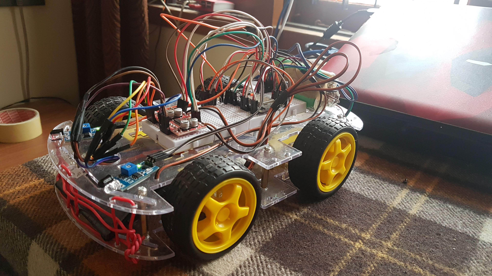
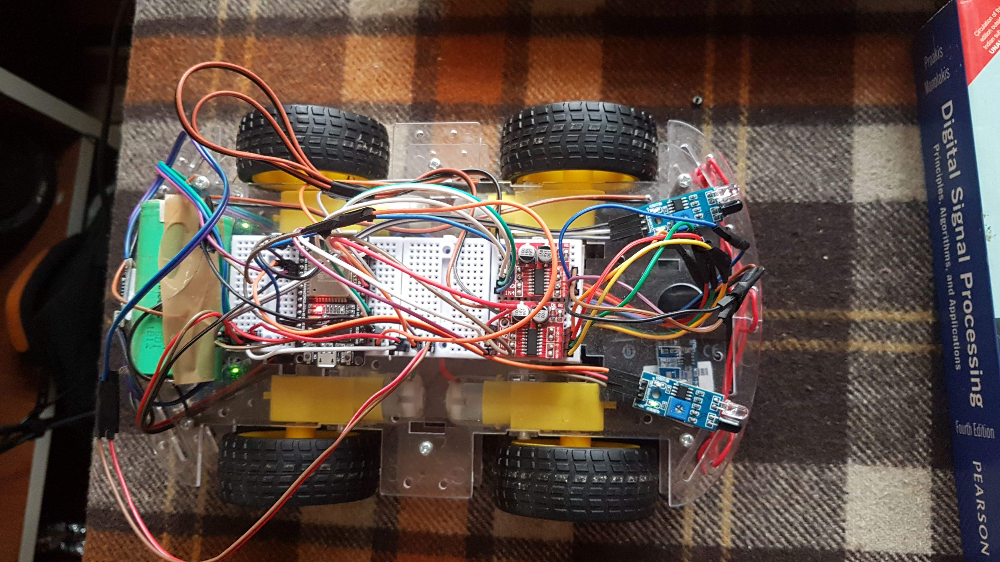

# 4WD MQTT BOT
## About
It is a wheeled ESP32 powered bot that can be controlled over MQTT protocol over WiFi. The MQTT broker (such as Mosquitto) can be used or Adafruit IO's free MQTT broker can be used.

The code uses PubSubClient as the MQTT library.

MQTT Topics:

- The bot publishes status with wifi RSSI at "mqttcar/status" topic , the on board LED on the ESP32 flashes in a certain pattern.
- The bot is subscibed to topic "mqttcar/input". Any input data to control the bot should be published to this topic.

    - Input commands : Publish the following commands as strings to the topic "mqttcar/input" to control the bot.
      
      "FORWARD" 
      
      "BACKWARD"
      
      "LEFT"
      
      "RIGHT"
      
      "STOP"
      
      "AUTO" : Enables the proximity sensors to detect obstacles in its path.
    
      "CRAZY" and "CRAZY2" : Rotates wheels in random directions, Helpful incase the bot is struck.
      
## Project Extra Features
- Magnetic charging dock.
      
- Onboarding measuring of battery voltage.
      
- OTA program updates.
      
## Ideas to be implimented in the future
      
Machine Learning mode - the bot predicts obstacles if it had encountered it before,even before the proximity obstacle detector senses it
      
Line Following mode - can follow predefined paths using proximity sensors(uses insfrared to detect black/white patterens).
      
Returns to charging docks by following line, when the battery becomes low.

      
    